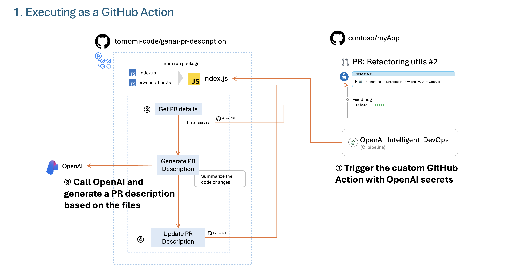
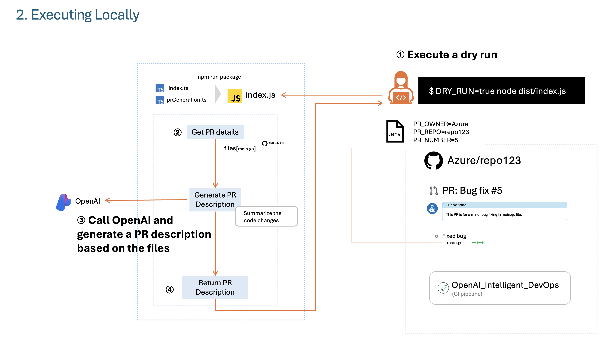

# genai-pr-description

This repository provides a GitHub Action powered by Azure OpenAI to generate intelligent pull request (PR) descriptions, perform code reviews, and manage issues.



## How to Set Up in Your Repository

To use this GitHub Action in your repository, follow these steps:

### 1. Add the Workflow File

Copy the workflow file from this repository located at `.github/workflows/code-review.yml` into your repository.

### 2. Add Required Secrets

Go to your repository settings and add the following secrets:

- `GITHUB_TOKEN`: Automatically provided by GitHub for workflows.
- `AZURE_OPENAI_API_KEY`: Your Azure OpenAI API key.
- `AZURE_OPENAI_ENDPOINT`: Your Azure OpenAI endpoint.
- `AZURE_OPENAI_DEPLOYMENT`: Your Azure OpenAI deployment name.

### 3. Trigger the Workflow

The workflow will automatically run on the following events:
- When a pull request is opened or synchronized.
- When manually triggered via the "Run workflow" button in the Actions tab.

### 4. Verify the Output

The GitHub Action will generate an AI-powered PR description and update the pull request with the new description.

---

For more details, refer to the workflow file at `.github/workflows/code-review.yml` in this repository.

## Development Guide

### Dev Container

This repository is configured for development in a [dev container](https://marketplace.visualstudio.com/items?itemName=ms-vscode-remote.remote-containers).
When you open the project in a dev container, all dependencies are installed automatically, and Husky git hooks are set up via the `postCreateCommand` in `.devcontainer/devcontainer.json`.

### Dry Run (Manual PR Description Generation)



You can generate a PR description **without updating GitHub** by running the action in "dry run" mode.  
This is useful for previewing the generated description or saving it locally.

1. Copy `.env.sample` to `.env` and fill in the required values (see comments in the file).
2. Run the script:

   ```sh
   DRY_RUN=true node dist/index.js
   ```

- The generated PR description will be printed to the console and will not update the PR on GitHub.
- All other environment variables (GitHub/Azure credentials, PR info) are read from your `.env` file.

### Running Tests

To run the test suite locally or in the dev container:

```sh
npm test
```

### Linting

To check code style and lint for errors:

```sh
npm run lint
```

### Pre-push Hook

A [Husky](https://typicode.github.io/husky/) pre-push hook is configured.  
Before every `git push`, the following will run automatically:

- `npm run lint`
- `npm test`
- `npm run package`

If any of these steps fail, the push will be aborted.

If you need to (re)install Husky hooks manually, run:

```sh
npm run prepare
```

### Packaging

To build and package the action (generates the `dist/` directory):

```sh
npm run package
```
