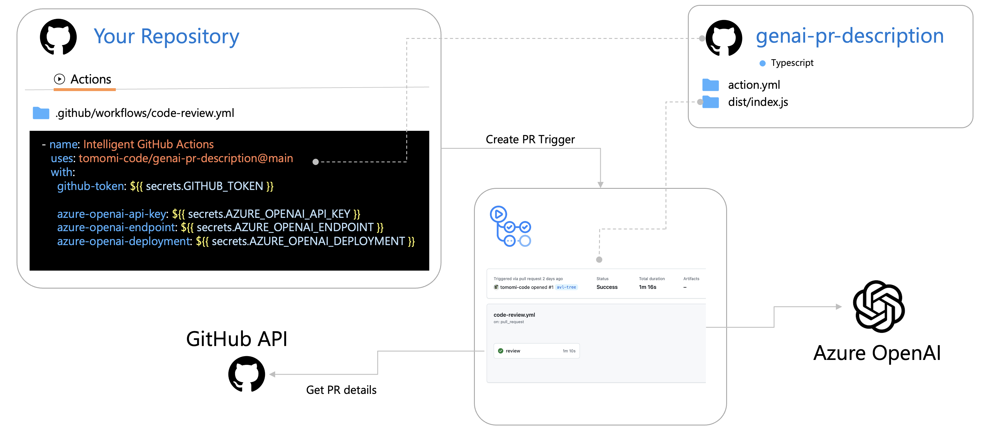

# genai-pr-description

This repository provides a GitHub Action powered by Azure OpenAI to generate intelligent pull request (PR) descriptions, perform code reviews, and manage issues.

## How to Set Up in Your Repository

To use this GitHub Action in your repository, follow these steps:

### 1. Add the Workflow File

Copy the workflow file from this repository located at `.github/workflows/code-review.yml` into your repository.

### 2. Add Required Secrets

Go to your repository settings and add the following secrets:

- `GITHUB_TOKEN`: Automatically provided by GitHub for workflows.
- `AZURE_OPENAI_API_KEY`: Your Azure OpenAI API key.
- `AZURE_OPENAI_ENDPOINT`: Your Azure OpenAI endpoint.
- `AZURE_OPENAI_DEPLOYMENT`: Your Azure OpenAI deployment name.

### 3. Trigger the Workflow

The workflow will automatically run on the following events:
- When a pull request is opened or synchronized.
- When manually triggered via the "Run workflow" button in the Actions tab.

### 4. Verify the Output

The GitHub Action will generate an AI-powered PR description and update the pull request with the new description.

---

For more details, refer to the workflow file at `.github/workflows/code-review.yml` in this repository.